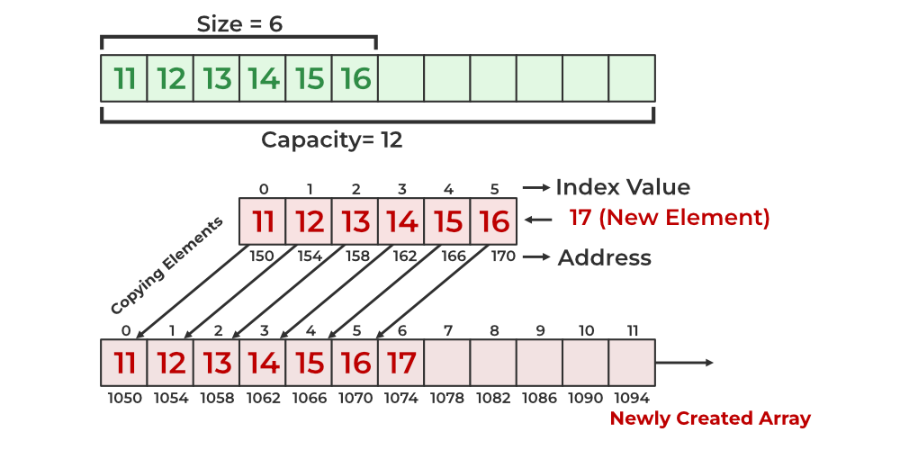
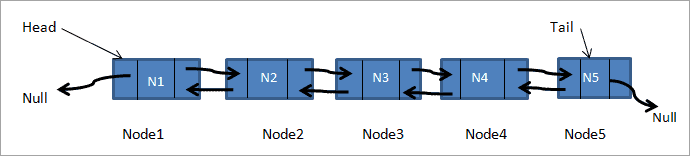
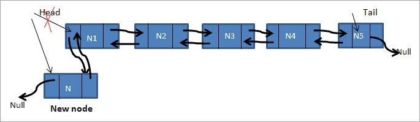
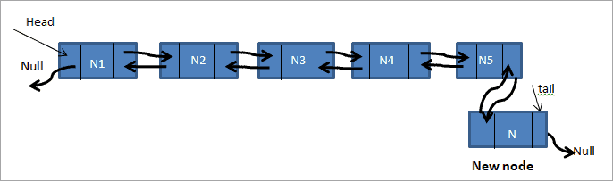
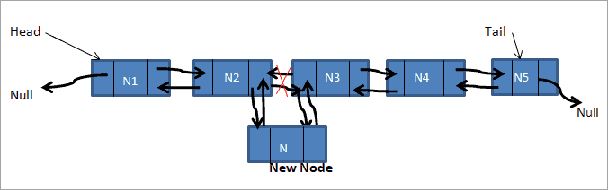
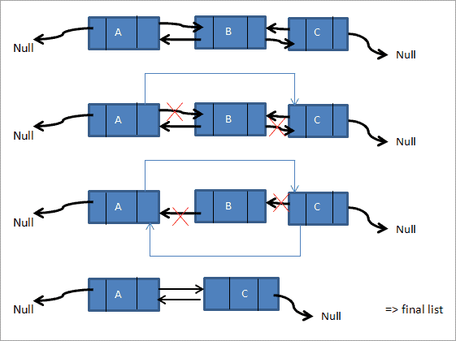

# Linked List

A liked list is similiar to a dynamic array in the sense that they are both linear data structures used to store collections of element. However, unlike arrays, linked lists do not require contiguous memory allocation, making them more adaptable for certain use cases. Some key purposes of linked list include **`dynamic memory allocation`**, **`efficient insertions and deletions`**, and **`easy manipulation`**. 

## Structure 

First lets tke a look at how a dynamic array is structured. To manipulate data requires us to copy everything to another array one at a time, which is a **`O(n)`** notation. This can become a problem if we had a very large array. We are also limited to the space that we set with memory potentially being unused. Via the picture below.


<!--- Reference 
https://medium.com/@michaelmaurice410/unlocking-the-power-of-dynamic-arrays-list-in-c-a-journey-of-growth-and-flexibility-55502c4423da --->

Now lets observe the basic structure of a doubly linked-list. We create **`Nodes`** that hold our data. Within a node we also hold pointers that make linked list possible. These pointers are usually called **`Head`**, **`Tail`**, **`Prev`** and **`Next`**.


<!--- Reference 
https://www.softwaretestinghelp.com/doubly-linked-list-2/ --->

## Operations

### Insert Head

We call the first node **`Head`** and by doing this we can then traverse through our list. To traverse backwards we call our last node **`Tail`**.

To insert data we only need to change where our pointers are directed. 

To insert at the beginning we have but four steps to follow:

 1. Create a new Node (call it newNode)
 2. Set the “next” of the new node to the current head (newNode.Next = head)
 3. Set the “prev” of the current head to the new node (head.Prev = newNode)
 4. Set the head equal to the new node (head = newNode)

 
<!--- Reference 
https://www.softwaretestinghelp.com/doubly-linked-list-2/ --->

There is a special case that exists for inserting at the head (and also inserting at the tail). If the linked list is empty (head == null) then all we have to do is set both the head and the tail to the new node we created.

#### Method to Add at the beginning

C# has built in linked-list at your diposal with methods. To create a linked-list and a node, do the following. Using the inbuilt classes can make your code simpliar and easier to use. To add at the beginning you call **``AddFirst(value)``**. 

```Csharp
// List called linkedList
LinkedList<int> linkedList = new LinkedList<int>();

// We can create a node. This way in the future when we search or modify the linked list 
// we can search by the node and not the value 
LinkedListNode<int> secondNode = linkedList.AddFirst(2);

// Or we can add at the head this way
linkedList.AddFirst(1); 
```

### Insert Tail

Inserting at the tail is almost identical as inserting at the head.

 1. Create a new node (we will call it newNode)
 2. Set the “prev” of the new node to the current tail (newNode.Prev = tail)
 3. Set the “next” of the current tail to the new node (tail.Next = newNode)
 4. Set the tail equal to the new node (tail = newNode)

 
<!--- Reference 
https://www.softwaretestinghelp.com/doubly-linked-list-2/ --->

#### Method to add at the end

The command to add at the end is **``AddLast(value)``**. 

```Csharp
// To add at the tail
linkedList.AddLast(4);
LinkedListNode<int>sixthNode = linkedList.AddLast(6);
```

### Insert in the center

To insert in the middle, we need to specify of a node in our list. The process is a little more complicated than adding at either end, since we have to change multiple pointers.

 1. Create a new node (we will call it newNode)
 2. Set the “prev” of the new node to the current node (newNode.Prev = current)
 3. Set the “next” of the new node to the next node after current (newNode.Next = current.Next)
 4. Set the “prev” of the “next” node after current to the new node (current.Next.Prev = newNode)
 5. Set the next of the current node to the new node (current.Next = newNode)

 
<!--- Reference 
https://www.softwaretestinghelp.com/doubly-linked-list-2/ --->

#### Method To Add at the center

Thankfully the method given to us simplifys the process. We are given **``AddBefore(Node, value)``**
and **``AddAfter(Node, value)``**

```Csharp
// To insert in the center
linkedList.AddAfter(secondNode, 3);
linkedList.AddBefore(sixthNode, 5);
```

### Remove

To remove from a linked list is simpler than adding. We need only to take two of our pointers and repoint them else where. Lets take a look at how to remove from the head then the center

To Reomve at the Head
 1. Set the “prev” of the second node (head.Next) to nothing (head.Next.Prev = null)
 2. Set the head to be the second node (head = head.Next)

To Remove at the center is essentially the same as removing from the head or tail.
 1. Set the prev of the node after current to the node before current (current.Next.Prev = current.Prev)
 2. Set the next of the node before current to the node after current (current.Prev.Next = current.Next)
 
 
<!--- Reference 
https://www.softwaretestinghelp.com/doubly-linked-list-2/ --->

#### Method to Remove

The methods to remove from the head, tail, or center are as follows in order **``RemoveFirst()``**, **``RemoveLast()``**, **``Remove(Node)``**.
```Csharp
// To Rmove 
linkedList.RemoveFirst();
linkedList.RemoveLast();
linkedList.Remove(secondNode);
```

### Find

To find a value or a node we can loop through our list. The method **``Find(value)``** is easier to code but is just a loop.

#### Method to Find

```Csharp
// To find a value
var found = linkedList.Find(4);
// To print the value that we found 
Console.WriteLine(found?.Value);
```

## Big O notation

|   Method    |     Description    |  Performace  |
|:------------|:------------------:|-------------:|
|.AddFirst(value)|Add at the beginng|O(1)|
|.AddLast(value)|Add at the end|O(1)|
|.AddBefore(value, newValue)| Add in the center|O(n)
.AddAfter(value, newValue)|Add in the center|O(n)|
|.RemoveFirst()|Remove at the beginng|O(1)|
|.RemoveLast()|Remove at the end|O(1)|
|.Remove(value)|Remove at the center|O(n)|
|.Find(value)|Find a value or Node|O(n)|

## Example Problem: Music Playlist
Lets say we want to make a music playlist. We can use a linked-list to organize our music and play from either the beginning or end. 

Music Playlist Requirements:
- Allow user to add a song at any location
- Remove song
- Search for song
- Print playlist

You can go here to see how a stack can be used to solve this problem: [Example Problem](Linked-List/linked-list_example_problem/Program.cs)

To see Linked-List Methods in action go here: [Walkthrough](Linked-List/linked-list_walkthrough/Program.cs)

## Problem to Solve: Train Scheduling System

Your job is to build a program that can effectively manage scheduling train traffic for a city. Your program needs to be fast and able to manipulate data easily. A lot is riding on this project. Are you up to it?

Go here to work out the problem: [Problem](Linked-List/linked-list_problem/Program.cs)

You can compare your code with the solution here: [Solution](Linked-List/linked-list_solution/LinkedListSolution/Program.cs)

[Back to Welcome Page](0-welcome.md)