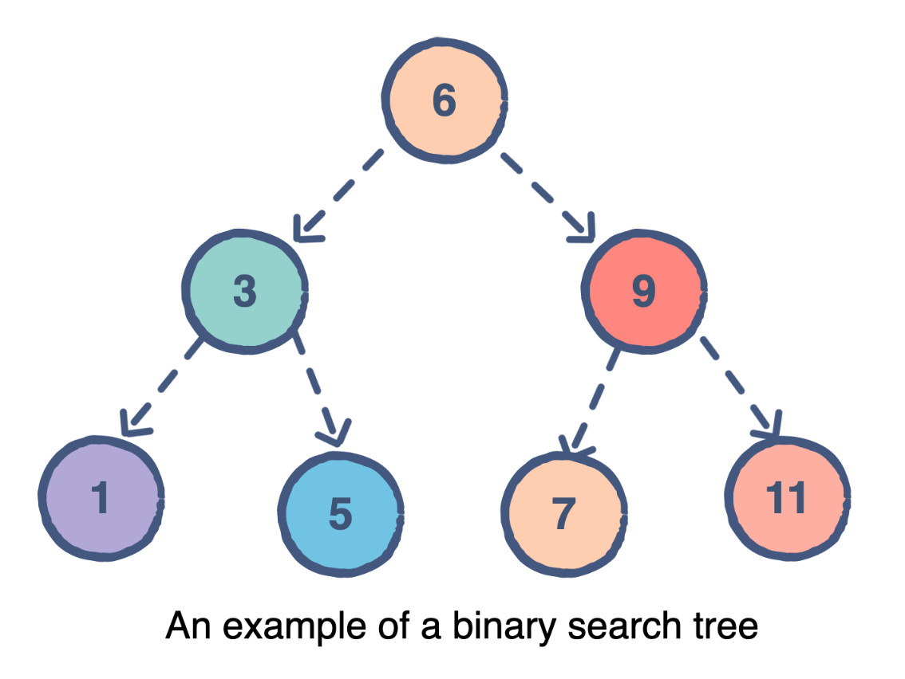
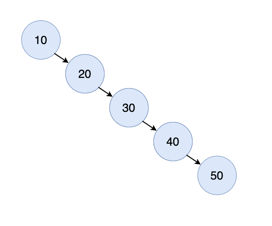
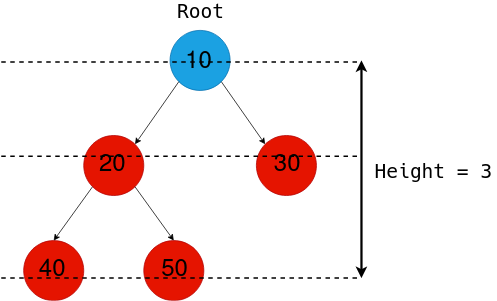

# Trees

Trees are similiar to linked list in that nodes are connected together by pointers. The difference being that trees can connect to multiple different nodes.


<!--- https://medium.com/@konduruharish/binary-search-tree-in-typescript-and-c-25fa5107cc5d --->

## Structure 

Lets breakdown the structure of a tree. At the top we have the root node. A node that has connected nodes is called a parent node. The node connected to the parent are called child nodes. The nodes to the left and right of any parent node form a subtree.The nodes that connect to no other nodes are called leaf nodes. 


<!--- https://www.csharpstar.com/csharp-program-to-implement-binary-search-tree/ --->

## Balance

Balancing a tree is important for data manipulation. If we don't have a balanced tree then our tree has the potential to become a linked list. The BST below is unbalanced and has a resulting performance for searching of O(n) instead of O(log n).


<!--- https://medium.com/geekculture/binary-search-tree-data-structure-part-1-e3842f4cfbc5 --->

### Height

To check for balance we can check the height of the tree. We can do this by counting the maximum number of nodes between root and the leaves. If a difference of height between subtrees is less than 2 then the tree is balanced. Otherwise the tree is unbalanced.


<!--- https://www.digitalocean.com/community/tutorials/height-of-a-binary-tree-in-c-plus-plus --->

## Operataions

### Inserting

Inserting into a tree requires recursion.
- The Smaller Problem: Inserting to the Left or Right based on the value
- Base case: If the subtree is empty giving space for the node, then the correct place has been found and the node can be entered

Lets break down the code for inserting. First, a Node class will consist with a value, left, and right pointers. We also will have two insert functions. One for the user to call then the other will be handle the recursion if the root isn't null.

```Csharp
// Insert a new node into the BST 
public void Insert(int data)
{
    Root = InsertRec(Root, data); // Reference 
}

private Node InsertRec(Node root, int data) 
{   // Base case
    if (root == null)
    {
        root = new Node(data);
        return root;
    }

    if (data == root.Data)
        root.Left = InsertRec(root.Left, data); // Value is the same the set to the left
    else if (data < root.Data)  
        root.Left = InsertRec(root.Left, data); // If value is the less set to the left
    else if (data > root.Data)
        root.Right = InsertRec(root.Right, data); // If value is greater set to the right
        
    return root;
}
```

Now that the data structure has been created, the user can simply insert a value in the program in main.

```Csharp
BinarySearchTree bst = new BinarySearchTree();
bst.Insert(50);
bst.Insert(30);
bst.Insert(30); 
bst.Insert(70);
bst.Insert(20);
bst.Insert(40);
bst.Insert(60);
bst.Insert(80);

// The tree will look something like this
//          50
//         /  \
//       30    70
//      / \    / \
//    30  40  60  80
//   /
//  20
```

### Remove

To remove from a Tree we need to search for it. The benefit of a tree over a linked list is that in a linked list we need to search from each one resulting in a **`O(n)`** opposed to a tree where searching or removing in this case results in a **`O(log n)`**. Lets observe the code to eximine how the data structure works and then how you can use it.

```Csharp
public void Remove(int data) {
Tree = RemoveRec(Tree, data);

}
private Node RemoveRec(Node root, int data) {

// Base case
if (root == null) {                     
    return null; 
}

// Data is less than go left
if (data < root.Data) {
    root.Left = RemoveRec(root.Left, data); 

// Data is greater go right
} else if (data > root.Data) {
    root.Right = RemoveRec(root.Right, data);

// Found value
} else {
    // No leaves or both are null
    if (root.Left == null && root.Right == null){
        return null;
    }

    // Left is null so return right
    if (root.Left == null)
        return root.Right;
    // Right is null so return left
    else if (root.Right == null)
        return root.Left;

    
// Merge Left and Right
// This is how we reshape our subtrees
Node leftSubtree = root.Left;
Node rightSubtree = root.Right;

// Find where to attach the right subtree in left subtree
Node attachPoint = leftSubtree;
while (attachPoint.Right != null)
    attachPoint = attachPoint.Right;

attachPoint.Right = rightSubtree;

return leftSubtree;
}

return root;
}
```
Now the all the user has to do is use **`bst.Remove(value)`** and the tree will search for the value, remove, and reshape the tree. 


A tree is a powerful data structure especially with large amounts of data because of it's Big O notation.  

## Big O notation

|   Method    |     Description    |  Performace  |
|:------------|:------------------:|-------------:|
|insert(value)|Insert into a tree|O(log n)|
|remove(value)|Remove from a tree|O(log n)|
|contains(value)|Search for value|O(log n)|
|height(value)|Determine the height of a node|O(n)|

## Example Problem: Student ID's

Trees are fast with an O(log n) notation. The benefit is that we can create a large storage of sudent ID's and manipulate the data quickly. 

You can go here to see how a Tree can be used to solve this problem: [Example Problem](Trees/trees_example_problem/Program.cs)

To see tree Methods in action go here: [Walkthrough](Trees/trees_walkthrough/Program.cs)

## Problem to Solve: Inventory

You work at a large company with a large inventory. Think Amazon, Walmart, or Best Buy. You must write a program that can organize, access, and manipulate this data quickly for the company and it's users.

Go here to work out the problem: [Problem](Trees/trees_problem/Program.cs)

You can compare your code with the solution here: [Solution](Trees/trees_solution/Solution.cs)

[Back to Welcome Page](0-welcome.md)